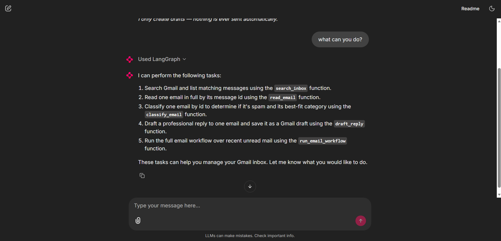

# 📧 Mail Sorting Agent

A **LangGraph + Groq** email agent for Gmail, with a **Chainlit chat UI**. Chat in plain
English to search your inbox, classify mail (spam / category), and draft replies — the agent
calls the right tool for you, or runs the whole workflow on command. **Draft-only: nothing is
ever sent automatically.**



## Features
- 💬 **Chat interface** — natural-language control, with each tool call shown as a step.
- 🛠️ **Tool-calling** — invoke tools on demand ("classify email &lt;id&gt;") or let the agent chain them.
- 🔁 **Full workflow** — "run the workflow on my 5 newest unread" → read → classify → draft.
- 🧠 **Groq LLM** (`llama-3.3-70b-versatile`) for classification and reply drafting.
- 🔒 **Safe by design** — scopes limited to `readonly` + `compose`; creates drafts only.

## Quickstart (uv)

```bash
cd Langgraph/Mail_sorting_agent
uv venv --python 3.14
uv pip install -r requirements.txt
uv run chainlit run app.py -w      # → http://localhost:8000
```

Prerequisites in this folder / repo root:
- **`credentials.json`** — Google OAuth Desktop client (first run opens a browser once; caches `token.json`).
- **`GROQ_API_KEY`** in the repo-root `.env` (see `.env.example`).

`credentials.json`, `token.json`, and `.env` are git-ignored — never commit them. Google Cloud
setup steps are in [docs/learning.md](docs/learning.md).

## The tools
| Tool | What it does |
|------|--------------|
| `search_inbox(query, max_results)` | list messages matching a Gmail query |
| `read_email(message_id)` | full sender / subject / body |
| `classify_email(message_id)` | spam? + category + reason |
| `draft_reply(message_id)` | write a reply → save a Gmail **draft** |
| `run_email_workflow(max_results)` | full pipeline over unread mail |

## Project structure
| Path | Purpose |
|------|---------|
| `app.py` | Chainlit UI — builds the ReAct agent, renders tool steps |
| `agent_core.py` | Gmail service, helpers, LLM, the LangGraph `email_graph` |
| `tools.py` | the 5 LangChain tools (`TOOLS`) |
| `workflow.ipynb` | original notebook — the step-by-step teaching version |
| `chainlit.md` | Chainlit welcome screen (must stay in root) |
| `requirements.txt` | pinned deps (verified on Python 3.14) |
| `docs/` | [UI_PLAN.md](docs/UI_PLAN.md) (UI design & prompts), [learning.md](docs/learning.md) (build journey) |

## Docs
- **[docs/UI_PLAN.md](docs/UI_PLAN.md)** — chat UI architecture, tool table, example prompts.
- **[docs/learning.md](docs/learning.md)** — the build journey (Gmail MCP → direct API), gotchas, Cloud setup.

## Stack
LangGraph · LangChain · Groq · Chainlit · google-api-python-client · uv · Python 3.14